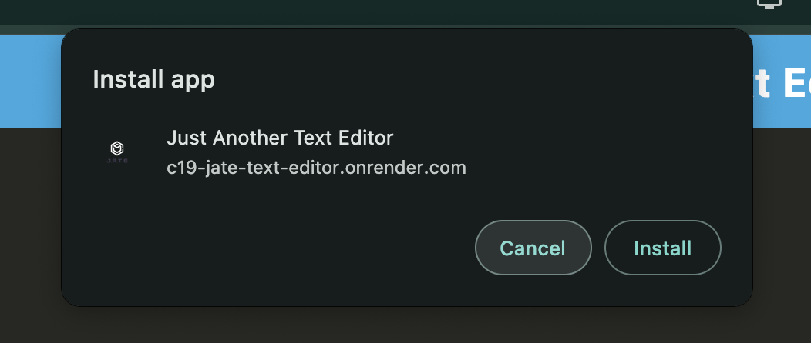
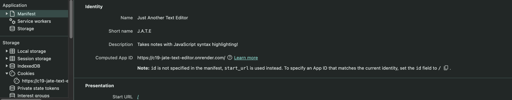

```bash
        _____  ____________
       / /   |/_  __/ ____/
  __  / / /| | / / / __/   
 / /_/ / ___ |/ / / /___   
| ____/_/  |_/_/ /_____/   

The best text editor around!
```

<p align="center">
  <a href="https://github.com/Rod-Freedom/C19-Jate-Text-Editor/blob/main/LICENSE"></a>
</p>

<br>
<br>

## **ABOUT THE PROJECT**
### **Overview**

The Text Editor WebApp is a robust and user-friendly browser-based text editor designed as a single-page application (SPA). Built to meet Progressive Web App (PWA) criteria, this application provides a seamless and reliable user experience, even when offline.

*Find the repo [here](https://github.com/Rod-Freedom/C19-Jate-Text-Editor).*<br>
*Find the site [here](https://c19-jate-text-editor.onrender.com/)!*<br>
*Watch our tutorial [**here**](https://youtu.be/fO3v9G5R15Y).*

<br>
<br>

## Table of Contents
- [License](#license)
- [Resources](#resources)
- [Get Started](#get-started)
- [Usage](#usage)
- [Contribute](#contribute)
- [Credits](#credits)

<br>

[(Back to the Top)](#about-the-project)

## Resources
* Single-Page Application (SPA): Provides a fluid and responsive user experience by loading all content on a single page.
* Progressive Web App (PWA): Incorporates PWA technologies to enhance performance and offline usability.
* IndexedDB & idb: Manages and persists user data, offering reliable storage solutions and seamless integration.

<br>

[(Back to the Top)](#about-the-project)

## Get Started
*Watch our tutorial [**here**](https://youtu.be/fO3v9G5R15Y).*

Just go to the site and write away!<br>
*Find the site [here](https://c19-jate-text-editor.onrender.com/)!*<br>

<br>

[(Back to the Top)](#about-the-project)

## Usage
*Watch our tutorial [**here**](https://youtu.be/fO3v9G5R15Y).*

You can use it offline or install it, just by clicking `install` at the top-left corner.






<br>

[(Back to the Top)](#about-the-project)

## License
<br>
See the [license](https://github.com/Rod-Freedom/C19-Jate-Text-Editor/blob/main/LICENSE) for more details.

<br>

[(Back to the Top)](#about-the-project)

## Contribute
If you have suggestions or want to help with some improvements, you can write me by [email](mailto:rod@alpacaazul.mx).

<br>

[(Back to the Top)](#about-the-project)

## Credits
[Rod's Freedom](https://github.com/Rod-Freedom) as contributor from an initial edX BootCamp code.

<br>

[(Back to the Top)](#about-the-project)